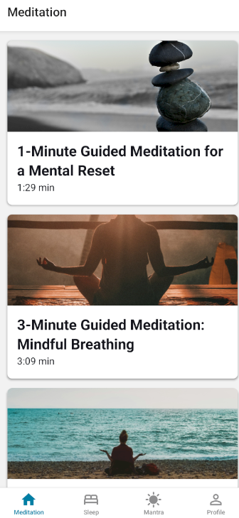
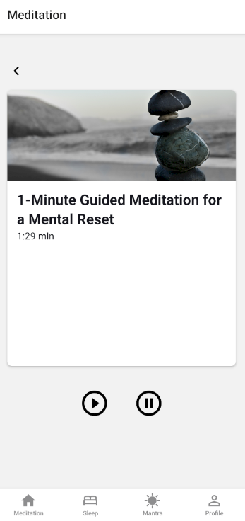
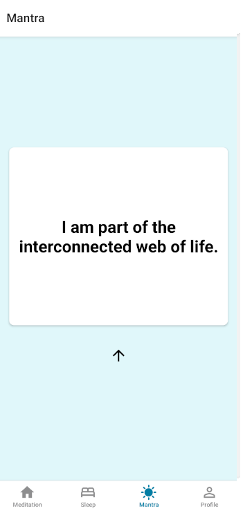
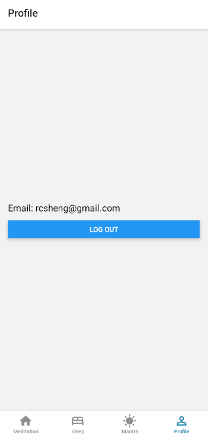
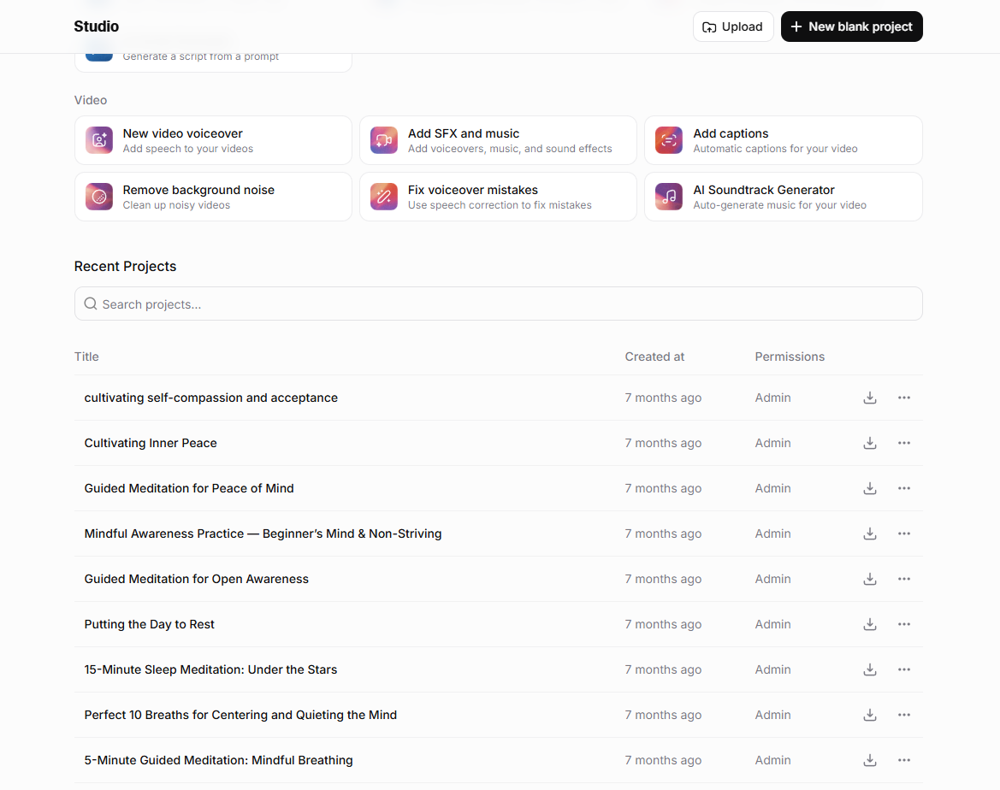

# Mantra

**Mantra** is a cross-platform wellness app built with [Expo](https://expo.dev/) and React Native, featuring:

- Guided meditations
- Sleep stories
- Affirmations
- User authentication via Firebase
- Audio streaming from Firebase Storage

## Features

- **Guided Meditations:** Listen to mindfulness meditations with beautiful illustrations.

- **Sleep Stories:** Relax at night with calming audio tales.

- **Affirmations/Mantras:** Swipe for fresh, positive mantras anytime.

- **User Profiles:** Sign up, log in, and reset passwords securely via Firebase Authentication.

- **Audio Streaming:** Meditations and stories are streamed directly from cloud storage (Firebase Storage).
- **Cross-Platform:** Works on Android, iOS, and web (with some platform-specific tweaks).

## AI Generated Content

- All transcripts were generated with ChatGPT
- All voice audio were generated with ElevenLabs
- Mantras were generated with ChatGPT

## Vibe Coding

Thanks Cursor (https://cursor.com/) for helping me develop this app! I use the assistant to help answer basic questions and agent mode to help complete code and update docs.

## Quickstart

### Prerequisites

- Node.js, npm or Yarn
- [Expo CLI](https://docs.expo.dev/get-started/installation/)
- Android Studio/iOS Simulator or real device

### Installation & Running

1. **Clone this repo**

   
    git clone <your-repo-url>
    cd Mantra
    2. **Install dependencies**

   
    npm install
    # or
    yarn install
    3. **Run the app**

   
    npm start
    # or
    yarn start
    # Then use Expo Go or a simulator to test!
    ### Scripts

- `npm start`: Launch Expo development server.
- `npm run android`: Run on Android.
- `npm run ios`: Run on iOS.
- `npm run web`: Run web build locally.
- `npm run reset-project`: Fresh scaffold (see scripts/reset-project.js).

### Environment & Firebase

- App requires Firebase configuration files for both Android (`google-services.json`) and iOS (`GoogleService-Info.plist`).
- Audio content and authentication are managed with Firebase. Make sure you update Firebase config files for your project.

## App Structure

- **/app/**
  - Main screens (sign up, login, forgot password, profile, meditations, sleep, etc.)
  - File-based routing via Expo Router.
- **/components/**
  - UI elements (MediaCard, MantraCard, Collapsible, etc.).
- **/assets/**
  - Fonts, images, and audio files.
- **/constants/**
  - Shared constants (e.g., color themes).
- **app.json**
  - Expo and native build config.

## Authentication

- **Sign Up:** New users register with email & password (Expo + Firebase).
- **Email Verification:** Required for access; verification email sent on signup.
- **Log In/Log Out:** Standard email & password login.
- **Reset Password:** Password reset handled via Firebase password reset email.
- **Protected Routes:** Some actions require authenticated users.

## Audio Playback

- Uses [expo-audio](https://docs.expo.dev/versions/latest/sdk/audio/) and Firebase Storage.
- Meditations and sleep stories are streamed on demand.

## Theming & UI

- Native look for both Android and iOS.
- Light/dark support (auto via device setting or user toggle if implemented).
- Custom vector icons and illustrations included.

## Learn More

- [Expo Official Docs](https://docs.expo.dev/)
- [React Native](https://reactnative.dev/)
- [Firebase for React Native](https://rnfirebase.io/)

## Contribution

Pull requests welcome! Please update tests as appropriate if you add features.

---

**Enjoy your meditation journey with Mantra!**